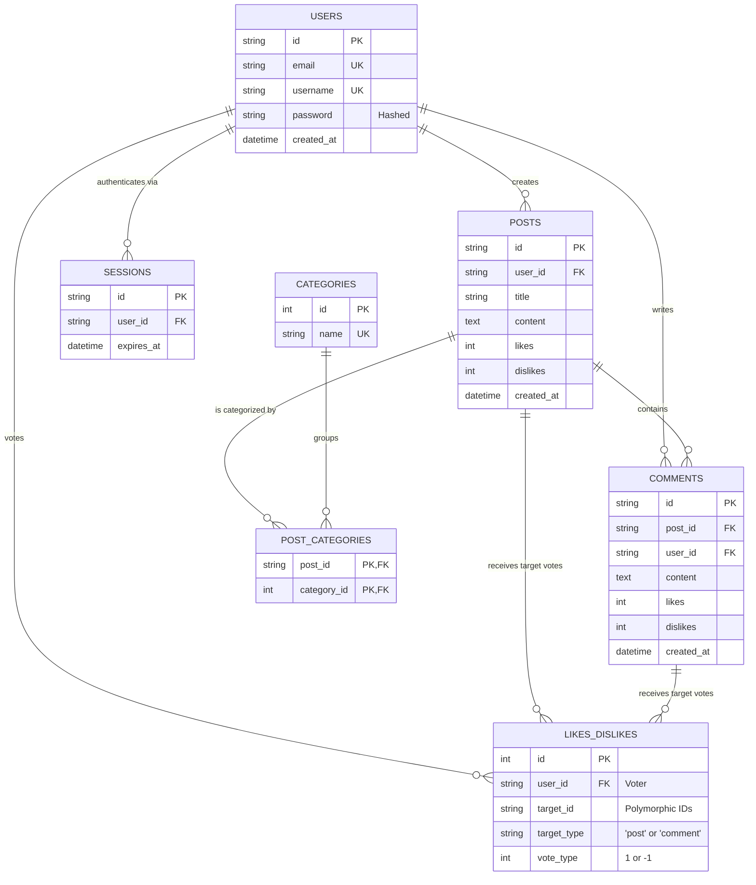

# Entity Relationship Diagram (ERD)

This document maps out the normalized relationship properties of our SQLite database entities using Mermaid architecture diagramming.

```mermaid
erDiagram
    USERS ||--o{ POSTS : "creates"
    USERS ||--o{ COMMENTS : "writes"
    USERS ||--o{ SESSIONS : "authenticates via"
    USERS ||--o{ LIKES_DISLIKES : "votes"
    
    POSTS ||--o{ COMMENTS : "contains"
    POSTS ||--o{ POST_CATEGORIES : "is categorized by"
    POSTS ||--o{ LIKES_DISLIKES : "receives target votes"
    
    CATEGORIES ||--o{ POST_CATEGORIES : "groups"
    
    COMMENTS ||--o{ LIKES_DISLIKES : "receives target votes"

    USERS {
        string id PK
        string email UK
        string username UK
        string password "Hashed"
        datetime created_at
    }
    
    SESSIONS {
        string id PK
        string user_id FK
        datetime expires_at
    }
    
    POSTS {
        string id PK
        string user_id FK
        string title
        text content
        int likes
        int dislikes
        datetime created_at
    }
    
    COMMENTS {
        string id PK
        string post_id FK
        string user_id FK
        text content
        int likes
        int dislikes
        datetime created_at
    }
    
    CATEGORIES {
        int id PK
        string name UK
    }
    
    POST_CATEGORIES {
        string post_id PK, FK
        int category_id PK, FK
    }
    
    LIKES_DISLIKES {
        int id PK
        string user_id FK "Voter"
        string target_id "Polymorphic IDs"
        string target_type "'post' or 'comment'"
        int vote_type "1 or -1"
    }
```
